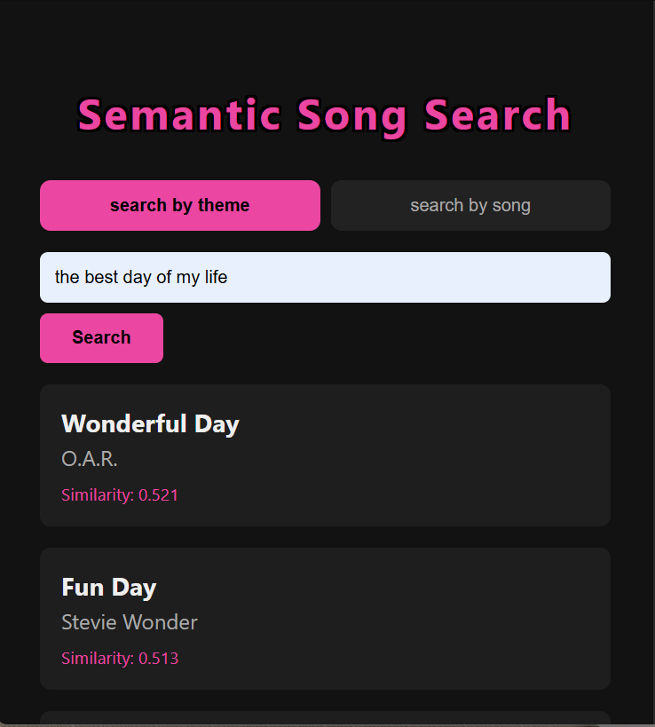
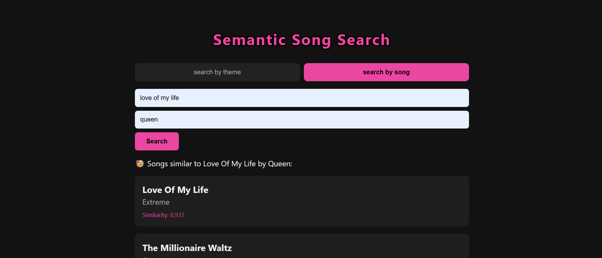

# Semantic Song Search

A semantic search engine for song lyrics — find songs by describing a theme, emotion, or scenario in natural language, or search by song title/artist to find similar songs.




🔗 **Live demo:** https://negardeilami.ir/semantic-song-search/
## What it does

1. **Search by theme** — enter a free-text description (e.g. *"missing someone after a breakup"*) and get back the most semantically similar songs from the dataset.
2. **Search by song** — enter a song title (optionally an artist), and the app finds that song, then returns songs with similar lyrical themes.

## How it works

- Song lyrics and titles are embedded using [`sentence-transformers/all-mpnet-base-v2`](https://huggingface.co/sentence-transformers/all-mpnet-base-v2) (768-dim).
- Long lyrics are split into overlapping chunks (to work around the model's max sequence length), embedded individually, and mean-pooled back into a single per-song vector.
- Title and lyrics embeddings are combined with a weighted average (alpha-weighted, favoring lyrics), then normalized.
- Retrieval is done via cosine similarity against the full precomputed embedding matrix — no vector database needed at this dataset size.
- Song lookup (title/artist) uses exact matching first, falling back to fuzzy string matching (`rapidfuzz`, `WRatio`) for typos or partial titles.
- A Flask backend exposes this as two JSON API endpoints; a small HTML/CSS/JS frontend calls them.

## Tech stack

- **ML/NLP:** `sentence-transformers`, `scikit-learn` (cosine similarity), `numpy`, `pandas`
- **Fuzzy matching:** `rapidfuzz`
- **Backend:** Flask, served in production via Gunicorn
- **Frontend:** vanilla HTML/CSS/JavaScript
- **Deployment:** Ubuntu VPS, Nginx reverse proxy, systemd (process management), Let's Encrypt (HTTPS)
- **Data/model hosting:** precomputed embeddings hosted on [Hugging Face Hub](https://huggingface.co/datasets/negar-ai/semantic-song-embeddings) (downloaded at app startup, kept out of this repo due to size)

## Dataset

~60,000 songs (title, artist, lyrics) sourced from a public Spotify lyrics dataset on [Kaggle](https://www.kaggle.com/datasets/joebeachcapital/57651-spotify-songs). Lyrics are cleaned (lowercased, dataset artifacts and section labels like `[Chorus]` removed, punctuation stripped) before embedding.

## Project structure

```
├── app.py                  # Flask app — routes, API endpoints
├── search.py                # Search logic (text query + song lookup)
├── song_lookup.py            # Exact + fuzzy song title/artist matching
├── create_embeddings.py       # One-time pipeline: clean data, chunk, embed, save
├── embedding_utils.py         # Chunking, pooling, title/lyrics combination, checkpointing
├── preprocessing.py           # Text cleaning for lyrics/titles/queries
├── evaluate.py                # Precision@k / Recall@k evaluation harness
├── evaluation/
│   └── eval_queries.csv       # Hand-labeled queries for evaluation
├── templates/
│   └── index.html
├── static/
│   ├── style.css
│   └── script.js
└── embeddings/                # Generated embeddings + metadata (not committed — see below)
```

## Running locally

```bash
pip install -r requirements.txt
python create_embeddings.py   # generates embeddings/ (or download precomputed ones — see below)
python app.py
```
Then open `http://127.0.0.1:5000`.

**Note:** the `embeddings/` folder (~1GB) is not committed to this repo due to size. `app.py` downloads the precomputed embeddings automatically from Hugging Face Hub on first run.

## Evaluation

Retrieval quality was measured with Precision@k / Recall@k against a hand-labeled query set (`evaluation/eval_queries.csv`). Honest note: performance on abstract, single-answer queries against the full 60k-song corpus is modest — a known, expected limitation of single-vector dense retrieval at this scale, discussed further in project notes. Several architectural choices (chunking strategy, title/lyrics weighting, model choice) were tested and compared rather than assumed.

## What's next

- Rebuilding/expanding the evaluation set to match the full dataset
- Farsi song support
- User-submitted songs
- Further dataset scaling

## Author

Built by Negar Deilami as a self-directed NLP/IR systems project.
